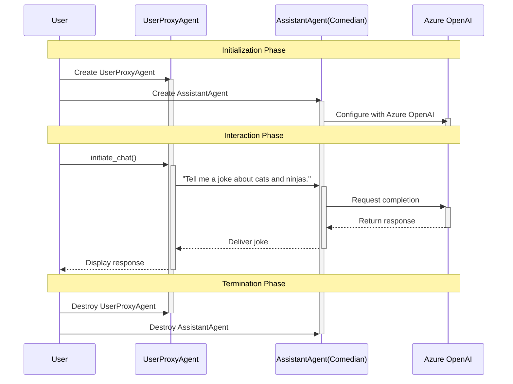
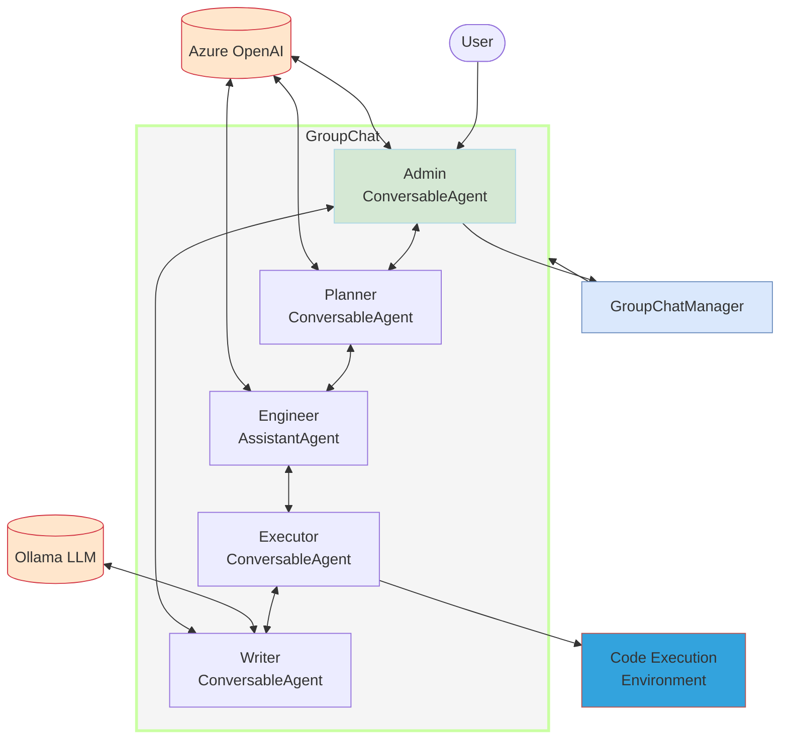

## Overview

This workspace contains two Python scripts, MultiAgents.py and SingleAgent.py, which utilize the `autogen` library to create and manage AI agents for different tasks.

## Prerequisites

- Python 3.7 or higher
- `pip` package manager
- `dotenv` library

## Setup

1. Clone the repository to your local machine.
2. Navigate to the project directory.
3. Install the required Python packages:
    ```sh
    pip install -r requirements.txt
    ```
4. Create a .env file in the root directory with the following content:
    ```env
    OPEN_API_KEY=your_open_api_key
    AZURE_OPENAI_ENDPOINT=your_azure_openai_endpoint
    AZURE_OPENAI_MODEL=your_azure_openai_model
    AZURE_OPENAI_API_VERSION=your_azure_openai_api_version
    AZURE_OPENAI_KEY=your_azure_openai_key
    OAI_CONFIG_LIST='[{"model": "llama3.2:latest","api_key": ""}]'
    ```
## Environment Variables

The application relies on the following environment variables, which should be defined in the .env file:

- `OPEN_API_KEY`: Your OpenAI API key.
- `AZURE_OPENAI_ENDPOINT`: The endpoint for Azure OpenAI.
- `AZURE_OPENAI_MODEL`: The model name for Azure OpenAI.
- `AZURE_OPENAI_API_VERSION`: The API version for Azure OpenAI.
- `AZURE_OPENAI_KEY`: The API key for Azure OpenAI.
- `OAI_CONFIG_LIST`: Configuration list for other models.

## Running the Applications

### SingleAgent
The SingleAgent.py script sets up a single agent to perform a specific task.

1. Ensure the .env file is correctly configured.
2. Run the script:
    ```sh
    python SingleAgent.py
    ```

### SingleAgent Flow



### MultiAgents Flow




The diagram shows how the five agents in MultiAgents.py work together in a group chat:
- The Admin agent interfaces with the user and provides feedback to the Writer
- The Planner determines information needed and steps to complete the task
- The Engineer writes code based on the Planner's guidance
- The Executor runs the code in a dedicated environment
- The Writer creates the blog post using results from the executed code

All these interactions are orchestrated by the GroupChatManager using a structured conversation flow.

### MultiAgents

The MultiAgents.py script sets up a group chat with multiple agents to complete a task collaboratively.

1. Ensure the .env file is correctly configured.
2. Run the script:
    ```sh
    python MultiAgents.py
    ```


## License

This project is licensed under the MIT License. See the LICENSE file for details.

## Contact

For any questions or issues
