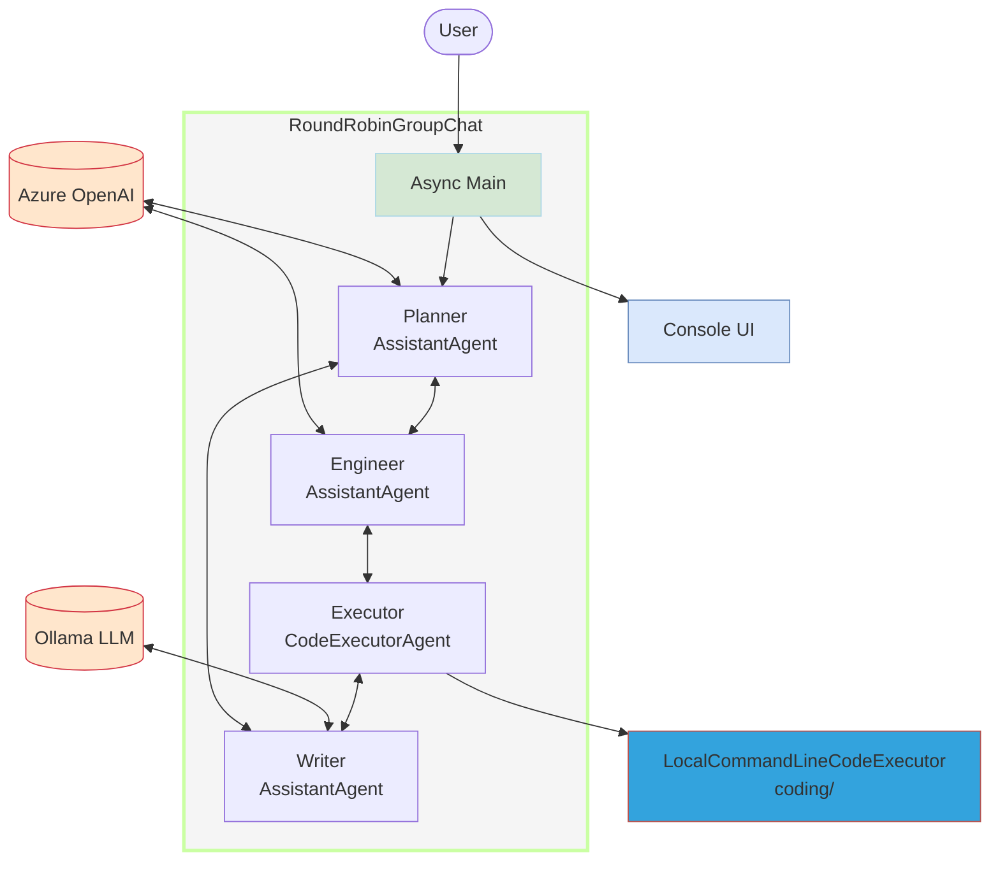

## Overview

This workspace contains two Python scripts, MultiAgents.py and SingleAgent.py, which utilize Microsoft's **AutoGen AgentChat** framework (version 0.7.5) to create and manage AI agents for different tasks. The framework has been updated to the latest version with improved async/await patterns and better model client integration.

## Prerequisites

- Python 3.10 or higher
- `pip` package manager

## Setup

1. Clone the repository to your local machine.
2. Navigate to the project directory.
3. Install the required Python packages:
    ```sh
    pip install -r requirements.txt
    ```
4. Create a .env file in the root directory with the following content:
    ```env
    AZURE_OPENAI_ENDPOINT=your_azure_openai_endpoint
    AZURE_OPENAI_MODEL=your_azure_openai_model
    AZURE_OPENAI_API_VERSION=your_azure_openai_api_version
    AZURE_OPENAI_KEY=your_azure_openai_key
    ```
## Environment Variables

The application relies on the following environment variables, which should be defined in the .env file:

- `AZURE_OPENAI_ENDPOINT`: The endpoint for Azure OpenAI (e.g., `https://your-resource.openai.azure.com/`)
- `AZURE_OPENAI_MODEL`: The Azure OpenAI deployment name (e.g., `gpt-4o`, `gpt-35-turbo`)
- `AZURE_OPENAI_API_VERSION`: The API version for Azure OpenAI (e.g., `2024-06-01`)
- `AZURE_OPENAI_KEY`: The API key for Azure OpenAI

**Note**: The MultiAgents script also uses Ollama for the Writer agent. Ensure you have Ollama running locally at `http://localhost:11434` with the `llama3.2:latest` model installed, or modify the configuration to use Azure OpenAI for all agents.

## Running the Applications

### SingleAgent
The SingleAgent.py script sets up a single agent to perform a specific task using async/await pattern.

1. Ensure the .env file is correctly configured.
2. Run the script:
    ```sh
    python SingleAgent.py
    ```

### SingleAgent Flow

```mermaid
sequenceDiagram
    
    participant User as User
    participant Main as Async Main
    participant Comedian as AssistantAgent(Comedian)
    participant Azure as Azure OpenAI
    
    Note over User, Azure: Initialization Phase
    User->>Main: Run python SingleAgent.py
    activate Main
    Main->>Comedian: Create AssistantAgent
    activate Comedian
    Comedian->>Azure: Configure AzureOpenAIChatCompletionClient
    activate Azure
    deactivate Azure
    
    Note over User, Azure: Interaction Phase
    Main->>+Comedian: run_stream(task)
    Comedian->>+Azure: Request completion
    Azure-->>-Comedian: Stream response
    Comedian-->>Main: Stream messages to Console
    Main-->>-User: Display response
    
    Note over User, Azure: Termination Phase
    Main->>Comedian: Complete
    deactivate Comedian
    deactivate Main
```

### MultiAgents Flow


```mermaid
flowchart TD
    User([User]) --> Main[Async Main]
    
    subgraph RoundRobinGroupChat
        Main --> Planner[Planner\nAssistantAgent]
        Planner <--> Engineer[Engineer\nAssistantAgent]
        Engineer <--> Executor[Executor\nCodeExecutorAgent]
        Executor <--> Writer[Writer\nAssistantAgent]
        Writer <--> Planner
    end
    
    Main --> Console[Console UI]
    
    AzureOpenAI[(Azure OpenAI)] <--> Planner
    AzureOpenAI <--> Engineer
    Ollama[(Ollama LLM)] <--> Writer
    
    Executor --> Code[LocalCommandLineCodeExecutor\ncoding/]
    
    style RoundRobinGroupChat fill:#f5f5f5,stroke:#caffa3,stroke-width:3px,color:#333
    style Main fill:#d5e8d4,stroke:#add8e6,color:#333
    style Console fill:#dae8fc,stroke:#6c8ebf,color:#333
    style AzureOpenAI fill:#ffe6cc,stroke:#d23342,color:#333
    style Ollama fill:#ffe6cc,stroke:#d23342,color:#333
    style Code fill:#33a3dd,stroke:#b85450,color:#333
```


The diagram shows how the four agents in MultiAgents.py work together in a round-robin group chat:
- The Planner determines information needed and steps to complete the task
- The Engineer writes code based on the Planner's guidance
- The Executor runs the code in a dedicated environment using LocalCommandLineCodeExecutor
- The Writer creates the blog post using results from the executed code

All interactions are orchestrated by the RoundRobinGroupChat team with a maximum of 10 messages.

### MultiAgents

The MultiAgents.py script sets up a round-robin group chat with multiple agents to complete a task collaboratively using async/await pattern.

1. Ensure the .env file is correctly configured.
2. (Optional) Ensure Ollama is running locally with llama3.2:latest model, or modify the Writer agent to use Azure OpenAI.
3. Run the script:
    ```sh
    python MultiAgents.py
    ```

## Key Changes in the Migration

This project has been migrated to use the latest Microsoft AutoGen framework (autogen-agentchat 0.7.5):

### What's New:
- **Updated Package**: Migrated from deprecated `autogen` to `autogen-agentchat` and `autogen-ext`
- **Async/Await Pattern**: All agent interactions now use modern async/await syntax
- **Improved Model Clients**: Using dedicated model client classes (`AzureOpenAIChatCompletionClient`, `OpenAIChatCompletionClient`)
- **Better Code Execution**: Using `CodeExecutorAgent` with `LocalCommandLineCodeExecutor` for safer and more structured code execution
- **RoundRobinGroupChat**: Simplified multi-agent orchestration with built-in team patterns
- **Console UI**: Built-in console streaming for better user experience

### Breaking Changes from Old AutoGen:
- Import paths changed: `from autogen import` → `from autogen_agentchat.agents import` and `from autogen_ext.models.openai import`
- Synchronous APIs replaced with async/await
- `UserProxyAgent` pattern replaced with direct task execution
- `GroupChat`/`GroupChatManager` replaced with team patterns like `RoundRobinGroupChat`
- Model configuration changed from dict to client objects


## License

This project is licensed under the MIT License. See the LICENSE file for details.

## Contact

For any questions or issues
